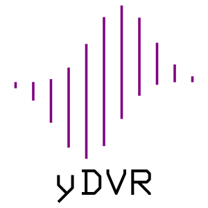

**To get the code, go to release page on Github to get the stable version (v 2.1.0).**  

# yDVR



A nuclear motion quantum mechanics solver library written in C++.

This project is a set of toy codes written by [Yu Zhai](http://www.zhaiyusci.net/).

## What are changed in version 2.x

### The whole project has been rewritten to make it object-oriented

In the past, I wrote yDVR as a set of functions.  There are many reasons, but the core one is that computational chemists prefer Procedural programming (?).

The drawback of procedural programming is the interface can be very complex and impossible to remember, even hard to check.  E.g., in yDVR 1.3, the following function is used to perform a PODVR computation

```cpp
int sincPODVR1d(yScalar m, int N, int NPO, yScalar a, yScalar b, const DoubleFunction1d& potential, yVector& x, yVector& E, yMatrix& wf, yMatrix& H_PODVR);
```

Even myself is driven crazy when using it in my new projects.

Now in yDVR 2.x, you can use the following code

```cpp
Oscillator co(m, pot);
SincDVR sincdvr(co,1.33,4.3,100 );
PODVR podvr(sincdvr, 10);
```

The readability has been improved and if you notice, now PODVR calculation can based on DVRs other than sinc-DVR because PODVR is now a decorator. (Yes!)  Although in version 2.0 there is only sinc-DVR available, other representations can be easily added in the future.

### XML input file reader and spline interpolation are removed

So you will not able to generate a list of potential point and then run yDVR directly.  By default, now yDVR is a shared library `libydvr.so`.  You have to write a piece of C++ code and call yDVR library to perform the calculation.

Is that more difficult to use?  I think the readability of the input file (If we stick to the concept) is much improved thank to the expressibility of C++ language.  You can read the `src/podvr_test.cc` as an example.

Some suggestions are given for those who are not familiar with modern C++ (Because users are more likely to be physical chemists rather than professional C++ programmers).

+ Potential function is used as argument of `Oscillator` class constructor.  It can be any *callable* objects, including functions, lambda expressions, and class with `operator()` overloaded.  I suggest you to use [lambda expression](https://en.cppreference.com/w/cpp/language/lambda) to convert the units in-line.  
+ Reference is what I like, and when design the interface, I avoid using pointers.  The good part of reference is that the user can release themselves from `*` `&` `->` `.` thing, and for most of time you can directly use stack variables instead of `new`-ing something from heap.  Therefore, you do not need to do the memory management.

### Multi-dimension DVR is now available

Now we have `OrthogonalMDDVR` class.  It can handle multi-dimension DVR problem.  

## Installation

1. The code is simple enough so I did not design a GNU Autotools thing.  
Instead, the Makefile is directly used.
2. You will find some variables in the `src/Makefile`, simply change them:
`CXX`, `EIGENROOT`, `CCFLAGS`.
3. The C++ compiler you use should support the C++11 standard.
As I know, `g++` from version 4.8 should work.
4. The project is based on [Eigen project](http://eigen.tuxfamily.org/index.php?title=Main_Page), 'install' Eigen before you compiler yDVR.  You can install Eigen by uncompress the tar.bz2 file in you home directory like this
```sh
$ pwd
/home/yuzhai
$ tar xf ~/Downloads/eigen-3.3.7.tar.bz2 # To uncompress the package you download from Eigen website
$ cd eigen-3.3.7/
$ pwd # The output should be used as EIGENROOT in Makefile, which contains `Eigen` directory
/home/yuzhai/eigen-3.3.7
```
5. Eigen is such a beautifully written library so `-O3` should be good for a good performance.

## Credits

This project is experimental with no warranty.

Here I thank the [Eigen project](http://eigen.tuxfamily.org/index.php?title=Main_Page). In 1.x version I used [TinyXML-2 project](http://www.grinninglizard.com/tinyxml2/index.html) to deal with I/O.

Also thank [Prof. Hui Li](http://huiligroup.org/).  He makes me aware that this field is very interesting.

This is my first C++ project and I hope you guys forgive that these codes are not robust enough.

## Known issues
+ Do not work well with PGI compiler `pgc++ 18.4-0 64-bit target on x86-64 Linux -tp haswell` because the project is based on Eigen.  
As a computational chemist I prefer leave this problem to Eigen development team ;-)
+ The design of the class inheritance hierarchy is not perfect, some more refactoring should be done.  However, I want to pause here.

